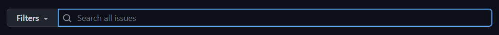
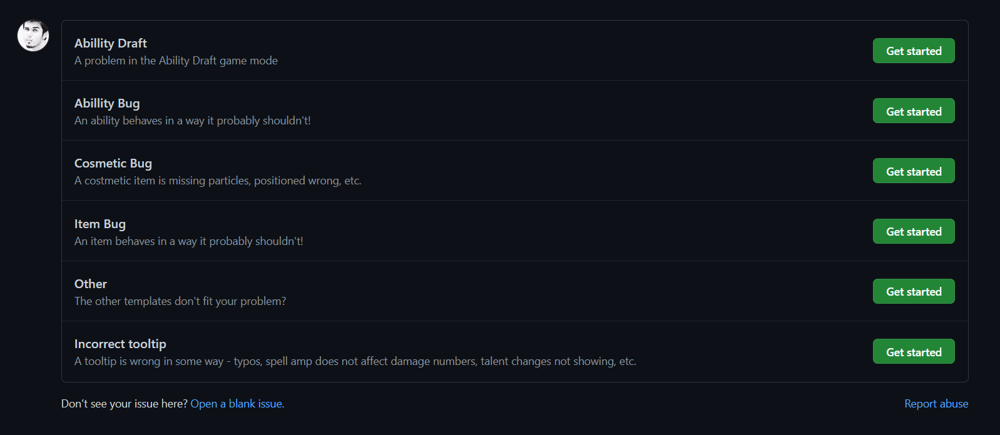

# **How To Submit A Bug Report?**

- Visit **https://github.com/jeffhill/Dota2**

- Click on the **Issues** tab on the top left of the page.

  

- On the Issues page, click on "**New Issue**" on the top right side.

  

 

---

 

## **Login To Github**

- If you are not logged in to Github, you will be prompted to do so. Please log in.
- **If you do not have an account on Github, you are required to make one.** Follow the instructions on the [**Github Signup Page**](https://github.com/signup).

 

---

 

## **Before Submitting A Report**

- Before submitting a new report, it is recommend that you search existing Issues to see if a report similar to yours has already been made. You can do this by using the **search bar** on the Issues page.

  

- If you find an existing Issue that is similar to what you wanted to report, you should just "**Thumbs Up**" that instead of creating a duplicate report.

- You can "**Thumbs Up**" by clicking on the Emoji Icon on the top right corner of any comment.

  

- Additionally, you can add more information to existing Issues by commenting on those threads to help resolve them faster.

 

---

 

## **Submitting A Report**

- If you are logged in, you will be presented with a set of templates. You can pick one that matches the type of bug you want to report or you can click on "[**Open a blank issue**](https://github.com/jeffhill/Dota2/issues/new)" to start fresh.

  

- Try and submit as much information as possible about the bug you are trying to report. Some useful details can be:

  - Match ID
  - Clear description of the bug
  - Timestamp when the bug occurs
  - Steps to reproduce this bug
  - Images and videos showing the bug

- Once you press Submit, your report should now be visible under the Issues section.

 

---

 

## **Closing A Report**

- Your report may be closed if a Dota Team developer has attended to it or marked it as resolved.
- You can close your own reports too if you have made a mistake in your submission or if the bug has now been fixed. You can find the Close button at the bottom the page on your Issue.
